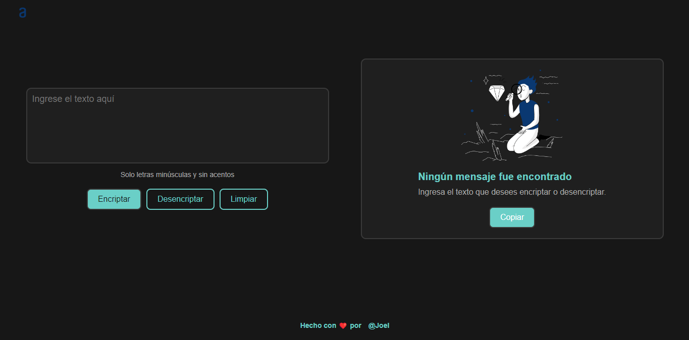

# Encriptador de texto

**Encriptador de texto** desarrollado con JavaScript, HTML y CSS para el challenge del Proyecto ONE de Oracle+Alura LATAM.

El desafío consiste en construir una página web que encripte y desencripte texto que será ingresado por el usuario y presentarlo en su forma encriptada o desencriptada. El objetivo de este desafío es poner a prueba los conocimientos adquiridos durante el curso "Principiante en programación".

## Llaves de encriptación

Las llaves de encriptación solicitadas son las siguientes:

- La letra "a" es convertida a "ai".
- La letra "e" es convertida a "enter".
- La letra "i" es convertida a "imes".
- La letra "o" es convertida a "ober".
- La letra "u" es convertida a "ufat".

## Requisitos

- Debe funcionar solo con letras minúsculas.
- No deben ser utilizadas letras con acentos ni caracteres especiales.
- Debe ser posible convertir una palabra a la versión encriptada y también devolver una palabra encriptada a su versión original.

Por ejemplo:

- "gato" => "gaitober"
- "gaitober" => "gato"

## ✒️ Autor

Desarrollado por [JoelDev](https://github.com/JoelDev13). Puedes encontrarme en [GitHub](https://github.com/JoelDev13).
